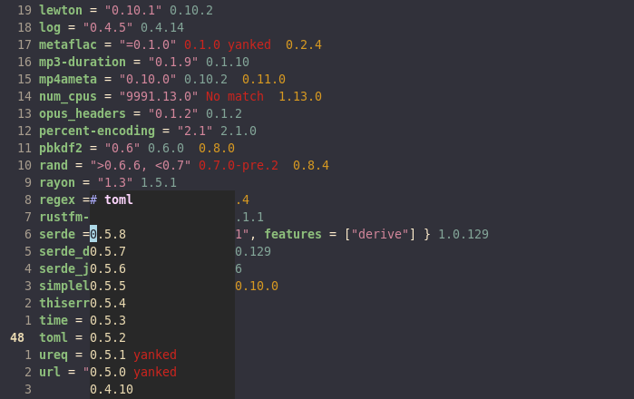

# crates.nvim
A neovim plugin show available crates.io versions

This is quite young software, so you might encounter some bugs.
Feel free to open issues.



## Features
- Autmatically load when opening a Cargo.toml file (`autoload`)
- Update while editing (`autoupdate`)
- Show currently usable version
- Show upgrade candidates
- Show if only usable version is yanked
- Show if no version is available
- Open floating window with all available versions

## Setup
```lua
require("crates").setup {
    autoload = true,
    autoupdate = true,
    loading_indicator = true,
    text = {
        loading = "Loading...",
        version = "%s",
        update = "  %s",
        error = "Error fetching version",
        yanked = "%s yanked",
    },
    highlight = {
        loading = "CratesNvimLoading",
        version = "CratesNvimVersion",
        update = "CratesNvimUpdate",
        error = "CratesNvimError",
        yanked = "CratesNvimYanked"
    },
    popup = {
        text = {
            yanked = "yanked"
        },
        highlight = {
            yanked = "CratesNvimPopupYanked"
        },
        keys = {
            hide = { "q", "<esc>" },
            copy_version = { "yy" },
        },
        style = "minimal",
        border = "none",
        max_height = 30,
        min_width = 20,
    },
}
```
### Functions
```lua
-- load and display versions
require('crates').update()

-- force-reload and display versions (clears cache)
require('crates').reload()

-- hide versions
require('crates').hide()

-- show/hide versions
require('crates').toggle()


-- show popup with all available versions (returns window id)
require('crates.popup').show_versions()

-- show popup with all available versions
require('crates.popup').hide_versions(win_id)
```

### Show versions popup when editing `Cargo.toml`
```viml
nnoremap <silent> K :call <SID>show_documentation()<cr>
function! s:show_documentation()
    if (index(['vim','help'], &filetype) >= 0)
        execute 'h '.expand('<cword>')
    elseif ('Cargo.toml' == expand('%:t'))
        lua require('crates.popup').show_versions()
    else
        lua vim.lsp.buf.hover()
    endif
endfunction
```

## TODO
- possibly port to teal?
- completion source for nivm-cmp

